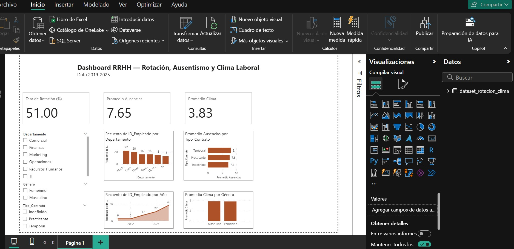

# Power BI aplicado a Recursos Humanos

Esta carpeta contiene una visuailzación real modelo desarrollada con Power BI para proyectos organizacionales en distintos sectores (alimentación, medios y servicios financieros).

Los dashboards están diseñados con enfoque en storytelling y toma de decisiones.

🔹 Control de rotación, ausentismo y desempeño  
🔹 Análisis de headcount y clima laboral  
🔹 Seguimiento de capacitaciones y productividad por sede

> Los datos han sido anonimizados. Todos los proyectos fueron validados por referentes del sector.
>
> 
